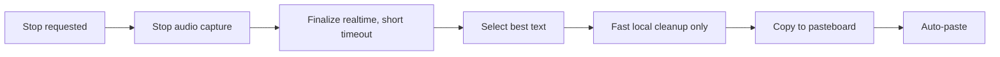
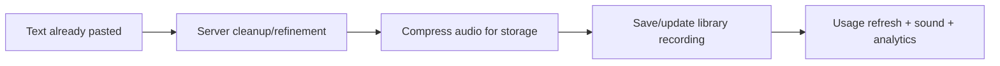
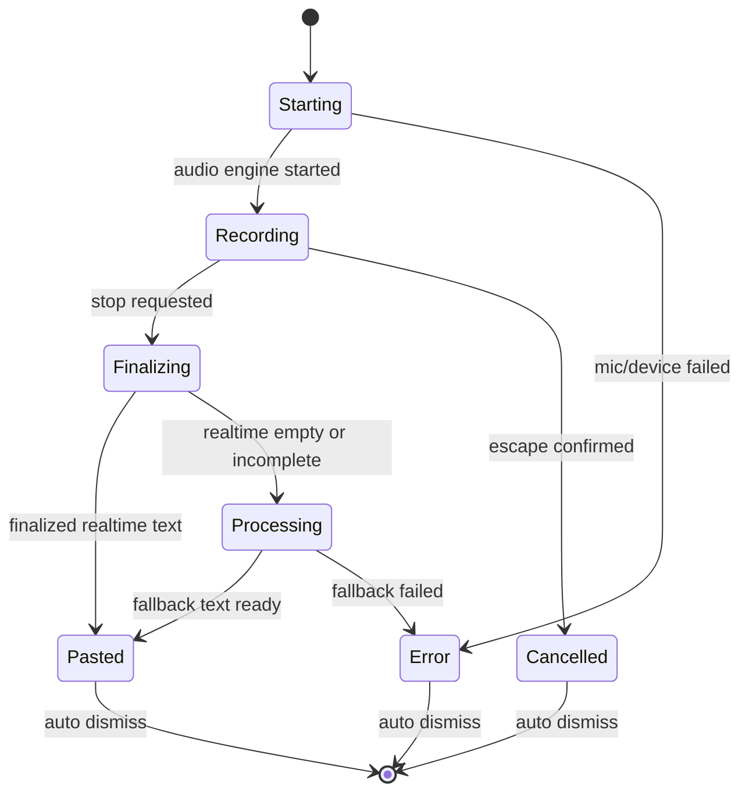

# Diduny Dictation Latency And Live Transcript Redesign

Дата аналізу: 2026-06-15

Фокус: voice dictation flow, тобто швидкість від дії користувача до старту запису, live feedback під час диктування, stop-to-text, copy/paste і auto-paste. Meeting/translation flows враховані тільки там, де вони впливають на спільну архітектуру.

## Короткий висновок

Зараз найкращий шлях до швидкої вставки вже частково є в коді: cloud realtime WebSocket для voice dictation. Але він прихований, вимкнений за замовчуванням, не показує токени в UI, втрачає provisional text, може пропускати перші аудіофрейми до `proxy_ready`, і навіть у realtime-success path все одно чекає cleanup/storage-роботу перед paste.

Рекомендований напрям:

1. Замінити notch як основну поверхню для voice dictation на non-activating floating panel.
2. Увімкнути cloud realtime для dictation як fast path для cloud-користувачів.
3. Показувати live tokens у panel: final text як основний, provisional як приглушений.
4. Дати кнопку Copy, яка копіює найкращий поточний текст навіть до завершення запису.
5. На stop робити copy/paste перед server cleanup, storage FLAC compression, library save і sound.
6. Лишити async HTTP/local Whisper як fallback, а не як основний шлях для швидкої диктовки.

Очікуваний ефект: для cloud realtime сценарію stop-to-paste має бути ближче до сотень мілісекунд після фіналізації WebSocket, а не до повного циклу `audio convert -> upload -> model -> cleanup -> storage`.

## Поточний voice dictation flow

### 1. Trigger

Global hotkey:

- `HotkeyService` реєструє `⌘⌥D` через `KeyboardShortcuts` (`Diduny/Core/Services/HotkeyService.swift:6-17`).
- Multi-press логіка спрацьовує у `handleMultiPress` (`HotkeyService.swift:191-205`).
- За замовчуванням dictation hotkey має `1x` press (`SettingsStorage.swift:403-413`).
- Handler викликає `toggleRecording()` (`AppDelegate+Hotkeys.swift:7-11`).

Push-to-talk:

- `PushToTalkService` слухає `.flagsChanged` глобально і локально (`PushToTalkService.swift:52-61`).
- Hold mode має hard floor `0.2s` (`SettingsStorage.swift:692-697`, `PushToTalkService.swift:253-257`).
- Реальний старт у hold mode викликається тільки після `Task.sleep(delay)` (`PushToTalkService.swift:195-215`).

Висновок: hotkey path може стартувати одразу, push-to-talk path свідомо додає мінімум 200 мс перед `startRecording()`. Це не баг, але для максимальної швидкості треба мати режим `instant hold`.

### 2. Start recording

Основний старт у `AppDelegate+Recording.swift:138-316`.

Порядок:

1. `canStartRecording(kind: .voice)` блокує паралельні режими (`AppDelegate+Recording.swift:141-144`).
2. Запитується mic permission (`AppDelegate+Recording.swift:146-158`).
3. Перевіряється provider: cloud або local model (`AppDelegate+Recording.swift:160-175`).
4. Резолвиться audio device (`AppDelegate+Recording.swift:177-206`).
5. Починається App Nap prevention (`AppDelegate+Recording.swift:210-214`).
6. UI state стає `.processing`, notch показує processing (`AppDelegate+Recording.swift:216-220`).
7. Налаштовується realtime callback, якщо cloud + realtime enabled (`AppDelegate+Recording.swift:223-225`).
8. Запускається `AudioRecorderService` (`AppDelegate+Recording.swift:227-231`).
9. Тільки після успішного `AVAudioEngine.start()` state стає `.recording` (`AppDelegate+Recording.swift:234-257`).
10. Вмикається Escape cancel і recovery state (`AppDelegate+Recording.swift:261-315`).

Висновок: користувач бачить `Processing...` ще до того, як аудіо реально пишеться. Це коректно, але UX має називати цей стан інакше: `Starting...` або `Arming...`, бо це не transcription processing.

### 3. Audio capture

`AudioRecorderService` створює `AVAudioEngine`, пише в temp WAV і паралельно може стрімити PCM у WebSocket.

Ключові місця:

- Timeout для audio hardware init: 5 секунд (`AudioRecorderService.swift:31-33`, `AudioRecorderService.swift:87-127`).
- Temp WAV пишеться у системний temp dir (`AudioRecorderService.swift:154-170`).
- Input tap має `bufferSize: 4096` (`AudioRecorderService.swift:195`).
- Tap пише buffer у file і віддає buffer у realtime streamer (`AudioRecorderService.swift:199-207`).
- Realtime streamer конвертує buffer у `s16le`, 16 kHz, mono (`AudioRecorderService.swift:491-568`).

Важливий ризик: `CloudRealtimeService.sendAudioData()` мовчки ігнорує audio data, якщо WebSocket ще не connected (`CloudRealtimeService.swift:188-190`). А WebSocket підключається в background і чекає `proxy_ready` до 10 секунд (`CloudRealtimeService.swift:171-180`). Тобто перші слова можуть не потрапити в realtime transcript, хоча fallback WAV їх збереже.

### 4. Realtime voice path

Voice realtime включається тільки якщо:

- provider effective cloud;
- `SettingsStorage.shared.transcriptionRealtimeSocketEnabled == true`.

Це у `setupVoiceRealtimeTranscriptionIfNeeded()` (`AppDelegate+Recording.swift:562-612`). Налаштування вимкнене за замовчуванням, бо getter просто повертає `defaults.bool` (`SettingsStorage.swift:553-559`).

Поточна поведінка:

- `RealtimeVoiceAccumulator` накопичує тільки `isFinal` tokens (`AppDelegate+Recording.swift:5-24`).
- Provisional/non-final tokens для voice dictation не потрапляють у UI і не зберігаються.
- `onTokensReceived` тільки викликає accumulator, не SwiftUI store (`AppDelegate+Recording.swift:579-584`).
- `onConnectionStatusChanged` тільки логує status (`AppDelegate+Recording.swift:586-588`).

Окремий backend-ризик: `CloudRealtimeService.connectWebSocket()` завжди ставить `"enable_speaker_diarization": true` (`CloudRealtimeService.swift:134-139`). Для персональної диктовки це зайва робота. Diarization треба лишити для meetings, але вимкнути для voice dictation.

### 5. Stop recording and paste

Основний stop у `AppDelegate+Recording.swift:318-558`.

Порядок зараз:

1. State стає `.processing` і notch показує processing (`AppDelegate+Recording.swift:334-337`).
2. Recorder зупиняється і читає увесь temp WAV у `Data` (`AudioRecorderService.swift:259-304`).
3. Audio стискається у FLAC для storage, якщо >= 1 MB (`AppDelegate+Recording.swift:361-363`, `AudioCompressionService.swift:32-58`).
4. Realtime session фіналізується (`AppDelegate+Recording.swift:365`, `CloudRealtimeService.swift:214-264`).
5. Якщо realtime text є, він використовується як `rawText`; інакше local Whisper або HTTP cloud (`AppDelegate+Recording.swift:367-378`).
6. Завжди викликається `TranscriptCleanupService.clean(...)` перед copy/paste (`AppDelegate+Recording.swift:379-383`).
7. Текст копіюється в pasteboard (`AppDelegate+Recording.swift:386-387`).
8. Якщо `autoPaste == true`, симулюється `⌘V` (`AppDelegate+Recording.swift:389-399`).
9. State стає `.success`, бібліотека зберігається, sound, recovery cleanup (`AppDelegate+Recording.swift:409-435`).

Висновок: stop-to-paste path зараз містить роботу, яка не має блокувати вставку:

- storage FLAC compression;
- server cleanup з timeout 3 секунди;
- library save;
- completion sound.

`ClipboardService` сам по собі не є головною проблемою: перед paste є 50 мс sleep і 12 мс key hold (`ClipboardService.swift:31-32`, `ClipboardService.swift:77-80`).

## Поточний UI

### Notch

`NotchManager` має стани `idle`, `recording`, `processing`, `success`, `error`, `info` (`NotchManager.swift:6-13`).

Він показує:

- compact/expanded notch через DynamicNotchKit (`NotchManager.swift:153-203`);
- audio level тільки як 3 маленькі bars (`NotchContentView.swift:143-163`);
- success preview до 35 символів (`NotchContentView.swift:237-278`);
- stop button під час recording (`NotchContentView.swift:324-337`).

Проблема для нового UX: notch не підходить для live transcript, copy button і scroll. Там мало місця, складний hit-testing, і поверхня прив'язана до фізичної чолки або fallback expand.

### Live transcript window

Є `LiveTranscriptView`, але воно зараз meeting-oriented:

- `500x600` звичайне `NSWindow` (`TranscriptionWindowController.swift:25-34`);
- `NSApp.activate(ignoringOtherApps: true)` краде фокус (`TranscriptionWindowController.swift:17-18`, `TranscriptionWindowController.swift:52-53`);
- має segments, provisional text, auto-scroll, Copy, Save (`LiveTranscriptView.swift:94-123`, `LiveTranscriptView.swift:180-207`);
- показується з meeting flow (`AppDelegate+MeetingRecording.swift:211-215`).

Для диктування це не годиться як є, бо диктування має вставляти текст у поточний активний застосунок. UI не має активувати Diduny і забирати focus.

## Latency-блокери

### Високий вплив

1. Realtime dictation вимкнений за замовчуванням.

   Cloud async path мусить записати файл, конвертувати/стиснути, завантажити, дочекатись моделі і cleanup. Realtime path уже є, але прихований (`SettingsStorage.swift:553-559`).

2. Server cleanup блокує paste.

   `TranscriptCleanupService.clean()` має request timeout 3 секунди (`TranscriptCleanupService.swift:65`) і викликається до copy/paste (`AppDelegate+Recording.swift:379-392`). Для UX швидкої диктовки cleanup треба або робити локально, або запускати після paste для library text.

3. Storage compression стоїть до realtime finalize.

   У voice stop `AudioCompressionService.compressToFLAC` виконується перед `stopVoiceRealtimeSession(finalize: true)` (`AppDelegate+Recording.swift:361-365`). Якщо realtime уже має текст, це зайва затримка перед вставкою.

4. WebSocket може пропустити початок фрази.

   Audio buffers приходять у `sendAudioData`, поки `isConnected == false`, і відкидаються (`CloudRealtimeService.swift:188-190`). Треба ring buffer на 1-2 секунди PCM до `proxy_ready`.

5. Diarization увімкнений для персональної диктовки.

   `enable_speaker_diarization` зараз hardcoded `true` у realtime config (`CloudRealtimeService.swift:134-139`). Для voice dictation це треба вимкнути.

### Середній вплив

6. Push-to-talk має мінімум 200 мс до старту.

   Це захист від випадкових натискань, але для power-user режиму варто дозволити `0.0s` або `0.1s`.

7. Local Whisper не streaming.

   Local path конвертує весь файл і запускає `whisper_full` на всіх samples (`WhisperTranscriptionService.swift:70-100`, `WhisperContext.swift:25-83`). Це нормальний batch flow, але не live dictation. Для local live треба окрема chunk/VAD архітектура.

8. Model unload policy може додати cold start.

   За замовчуванням Whisper model unload через 5 хв (`SettingsStorage.swift:505-517`, `WhisperModelUnloadPolicy.swift:3-35`). Для local-provider користувачів варто рекомендувати `Keep Loaded` або prewarm.

### Низький вплив

9. Paste simulation overhead.

   50 мс readiness delay і 12 мс key hold є дрібними порівняно з model/network/cleanup.

10. Notch success animation.

   Візуально може здаватись затримкою, але paste виконується до state `.success`.

## Що саме переносити після paste

Critical path до вставки має бути:

Після paste:

Не треба чекати після paste:

- FLAC compression для library;
- server cleanup;
- `RecordingsLibraryStorage.saveRecording`;
- usage refresh;
- sound.

Виняток: якщо realtime text порожній або явно incomplete, тоді треба показувати processing і йти в fallback transcription. Але це fallback, не fast path.

## Дизайн-варіанти

### Варіант A: One-Line Live Ticker

Форма:

- non-activating floating panel, top-center або near cursor;
- приблизно `520 x 52`;
- blur/vibrancy background;
- status dot + mic/audio level;
- один рядок live text;
- icon buttons: Copy, Stop;
- під час processing: spinner + `Processing`;
- після paste: checkmark + short pasted preview.

Поведінка тексту:

- final text рухається вліво, показує останні слова;
- provisional text приглушений;
- старий текст не скролиться, а “виходить” за лівий край;
- Copy копіює весь накопичений final + provisional snapshot, не тільки видимий рядок.

Плюси:

- найменше заважає;
- схоже на system HUD;
- добре для короткої диктовки в чат/браузер/IDE.

Мінуси:

- слабко підходить для довших думок;
- користувач бачить тільки хвіст фрази;
- важко візуально перевірити весь текст перед copy.

Коли обирати: якщо Diduny позиціонується як “говориш коротку фразу і вона миттєво вставляється”.

### Варіант B: Expanding Transcript Panel

Форма:

- non-activating floating panel;
- старт `560 x 84`;
- при появі тексту росте до `560 x 220-320`;
- ScrollView з transcript;
- bottom action row: Copy, Paste, Stop;
- status row: Recording / Finalizing / Processing / Pasted.

Поведінка тексту:

- final text звичайний;
- provisional text secondary/italic;
- auto-scroll до низу;
- після stop залишається на 2-4 секунди або поки користувач не скопіює.

Плюси:

- користувач бачить, що саме модель чує;
- copy button очевидний;
- добре для довших диктовок.

Мінуси:

- більше перекриває контент;
- якщо зробити як звичайне `NSWindow`, воно вкраде фокус; треба тільки non-activating `NSPanel`;
- більше UI-state complexity.

Коли обирати: якщо Diduny хоче бути “dictation assistant”, а не тільки невидимий paste accelerator.

### Варіант C: Hybrid Ticker → Expanded On Demand

Форма:

- старт як One-Line Live Ticker;
- автоматично розширюється, якщо:
  - текст > 140-180 символів;
  - запис > 10-15 секунд;
  - користувач натискає chevron/панель;
  - realtime connection має warning/fallback;
- після stop стискається у result bar з Copy/Paste status.

Поведінка:

- короткі фрази не займають екран;
- довгі фрази отримують scroll;
- Copy завжди доступний;
- Stop завжди на одному місці;
- Escape cancel працює як зараз.

Плюси:

- найкращий баланс швидкості й контролю;
- не карає короткі диктовки великою модалкою;
- дає місце для live transcript, коли це реально потрібно.

Мінуси:

- треба акуратно реалізувати resizing без layout jump;
- потрібна стабільна state-machine, щоб не миготіти між compact/expanded.

Рекомендація: обирати C як default, A як compact mode, B як forced expanded preference.

## Архітектура нового UI

### Не ламати call sites

Зараз `NotchManager` викликається з багатьох flows: voice, translation, meeting, meeting translation, file transcription. Найменш ризикований шлях: лишити public API `NotchManager` як façade, але всередині для voice dictation направляти події в новий `DictationOverlayController`.

Можливий наступний крок: перейменувати façade у `RecordingFeedbackCoordinator`, але це вже рефакторинг після стабілізації.

### Нові компоненти

1. `LiveDictationStore`

   Стан:

   - `mode`: compact / expanded;
   - `phase`: starting / recording / finalizing / processing / pasted / error;
   - `finalText`;
   - `provisionalText`;
   - `connectionStatus`;
   - `audioLevel`;
   - `startedAt`;
   - `lastCopiedAt`;

   Методи:

   - `processTokens(_:)`;
   - `bestText(includeProvisional:)`;
   - `markFinalizing()`;
   - `markPasted(text:)`;

2. `DictationOverlayController`

   `NSPanel` requirements:

   - `.borderless` + `.nonactivatingPanel`;
   - `isFloatingPanel = true`;
   - `level = .statusBar` або `.floating` після тесту з full-screen apps;
   - `hidesOnDeactivate = false`;
   - `isOpaque = false`, `backgroundColor = .clear`;
   - не викликати `NSApp.activate`;
   - позиціонування на active screen, бажано top-center з safe area від menu bar.

3. `LiveDictationOverlayView`

   SwiftUI:

   - compact ticker row;
   - expanded scroll body;
   - icon buttons з SF Symbols: copy, stop, expand/collapse;
   - audio level bars;
   - status microcopy без навчального тексту.

### Realtime wiring

`setupVoiceRealtimeTranscriptionIfNeeded()` має:

- створити `LiveDictationStore`;
- показати overlay одразу у `starting`;
- wire `onTokensReceived` у store;
- wire `onConnectionStatusChanged` у store;
- wire `onSegmentBoundary` у store;
- accumulator лишити як джерело final text для stop path або замінити його store-backed buffer.

Критично: provisional tokens треба показувати, але auto-paste має брати final text або чітко позначений finalized snapshot. Copy button може копіювати final + provisional, бо це явна дія користувача.

## Backend/API зміни, які варто зробити

1. `CloudRealtimeService.connect(...)` має приймати `enableSpeakerDiarization: Bool`.

   Для voice: `false`.
   Для meeting: `true`.

2. Додати client-side PCM ring buffer до моменту `proxy_ready`.

   Мінімум: 1-2 секунди або 64-128 KB PCM.

3. Voice finalize policy:

   Поточне `finalize()` чекає до 5 секунд (`CloudRealtimeService.swift:232-249`). Для диктовки варто мати коротший fast timeout, наприклад 1.2-1.5 секунди, і fallback:

   - якщо є finalized text: paste;
   - якщо є тільки provisional: показати Copy Now, але не auto-paste partial;
   - якщо text порожній: fallback async HTTP/local.

4. Server cleanup не має бути pre-paste dependency.

   Варіанти:

   - local cleanup before paste: trim, local filler removal, protected lexicon;
   - server cleanup after paste: update library transcript only;
   - setting `Prefer polished text over speed` для тих, хто хоче чекати cleanup.

## Implementation roadmap

### Phase 0: latency instrumentation

Додати lightweight trace для voice dictation:

- trigger received;
- state `.processing`;
- audio engine started;
- first audio buffer;
- realtime connect start;
- realtime connected/proxy_ready;
- first token;
- stop requested;
- recorder stopped/data read;
- realtime finalize start/end;
- raw text selected;
- cleanup start/end;
- pasteboard set;
- paste event posted;
- library save done.

Це можна зробити через `os.Logger` або `os_signpost`. Без цього оптимізації будуть частково на відчуттях.

### Phase 1: UI without behavior risk

- Додати `LiveDictationStore`.
- Додати `DictationOverlayController` як non-activating panel.
- Показувати overlay на voice recording start.
- Виводити audio level і status.
- Додати Copy button, що копіює `bestText(includeProvisional: true)`.
- Notch лишити як fallback або behind setting.

Ця фаза не має міняти transcription semantics.

### Phase 2: realtime visible fast path

- Увімкнути `transcriptionRealtimeSocketEnabled` для new installs або явно показати setting у UI.
- Wire voice realtime tokens у `LiveDictationStore`.
- Вимкнути diarization для voice.
- Додати PCM ring buffer до `proxy_ready`.
- На stop брати finalized realtime text як перший кандидат.

### Phase 3: move work after paste

- У voice stop path перенести storage compression після copy/paste.
- Не викликати server cleanup перед paste у fast mode.
- Library save виконувати після paste.
- Якщо cleanup повернув refined text, оновити library transcript, але не переписувати вже вставлений текст автоматично.

### Phase 4: fallback polish

- Якщо realtime failed або text empty, показувати expanded processing panel і запускати async HTTP/local fallback.
- Для local Whisper додати model prewarm option або дефолт `Keep Loaded` для local provider.
- Розглянути chunked local preview окремо; це не маленька зміна.

## Рекомендований UX state machine

UI labels:

- `Starting`: small spinner + mic icon.
- `Recording`: red dot + timer + live text + Copy + Stop.
- `Finalizing`: spinner + last transcript visible.
- `Processing`: spinner + transcript/fallback status.
- `Pasted`: checkmark + short preview + Copy remains available.
- `Error`: concise error + Copy if any text exists.

## Decision

Я б робив Hybrid Ticker → Expanded On Demand.

Причина: коротка диктовка має бути майже невидимою, але live transcript і Copy button потребують більше простору, коли текст стає довшим або коли realtime не встигає. Повністю велика модалка з першої секунди буде заважати, а тільки one-line ticker буде недостатній для перевірки тексту.

Перший технічний slice має бути не “перемалювати все”, а:

1. Новий non-activating overlay.
2. Token store для voice realtime.
3. Copy current transcript.
4. Diarization off для voice.
5. Move cleanup/compression after paste.

Це дає реальне прискорення, а не просто красивіший індикатор.
